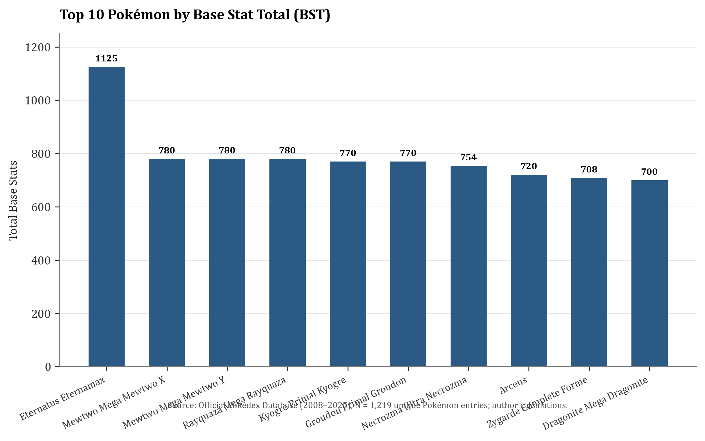
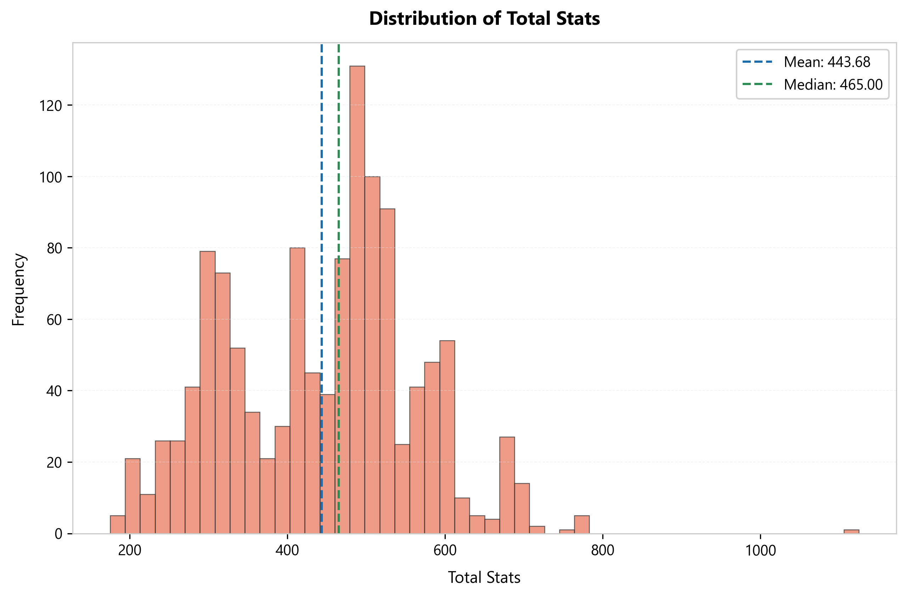
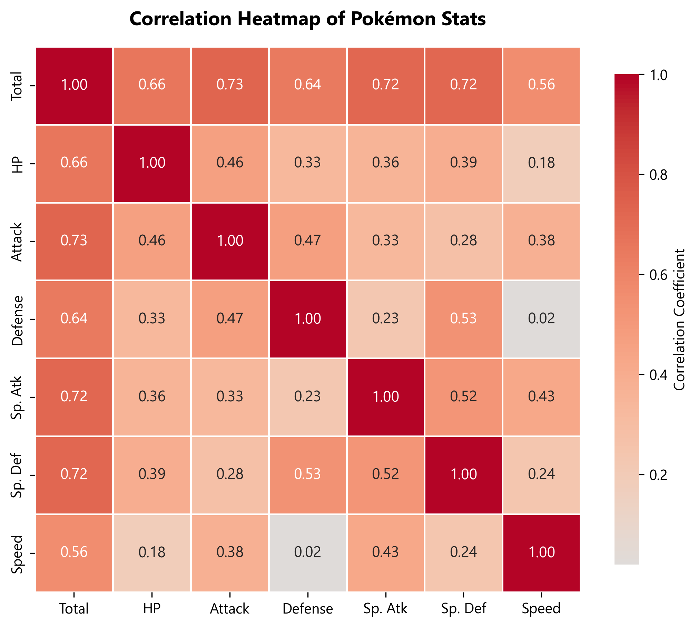
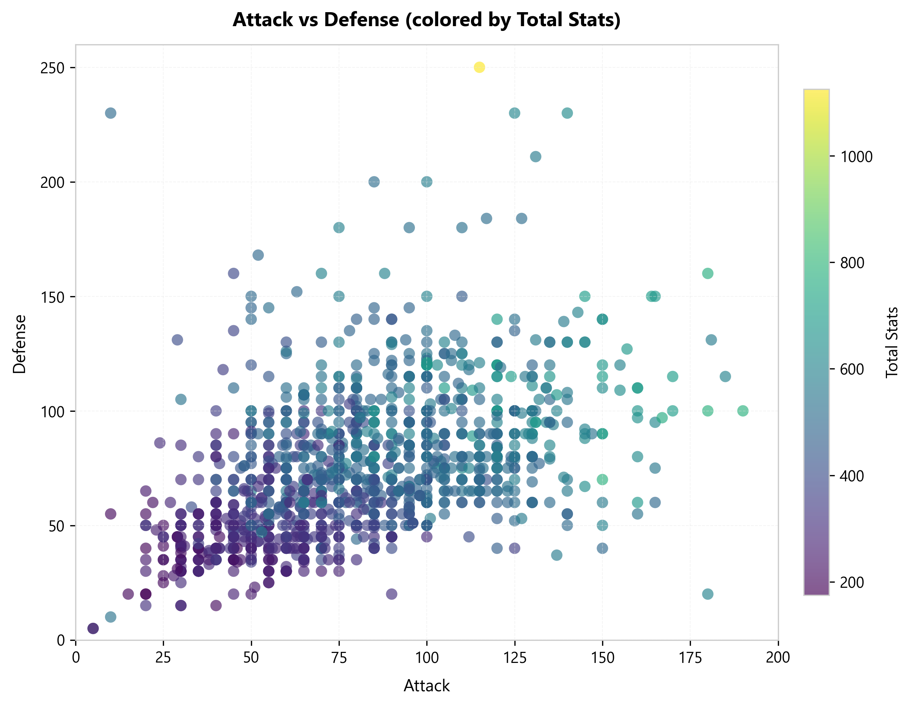
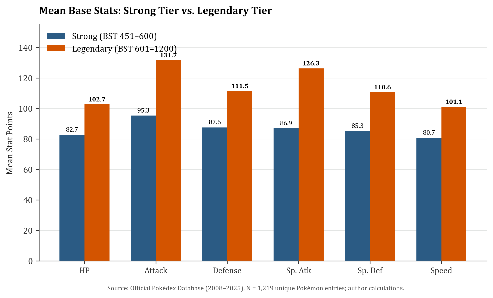
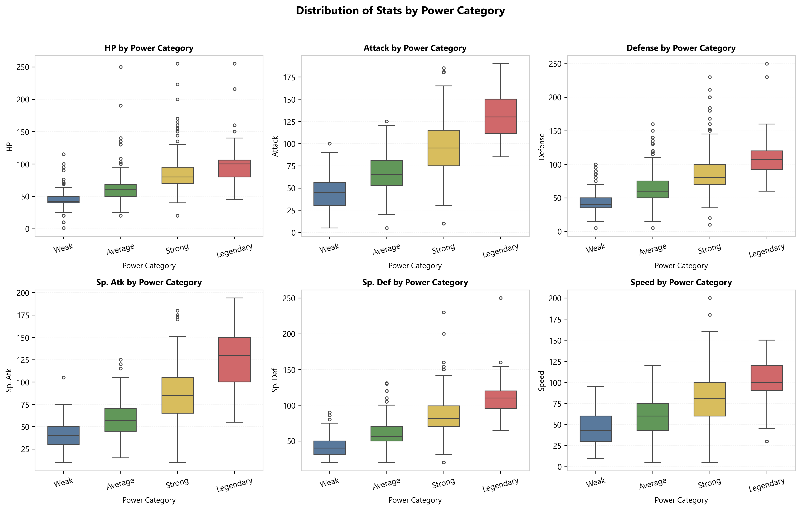
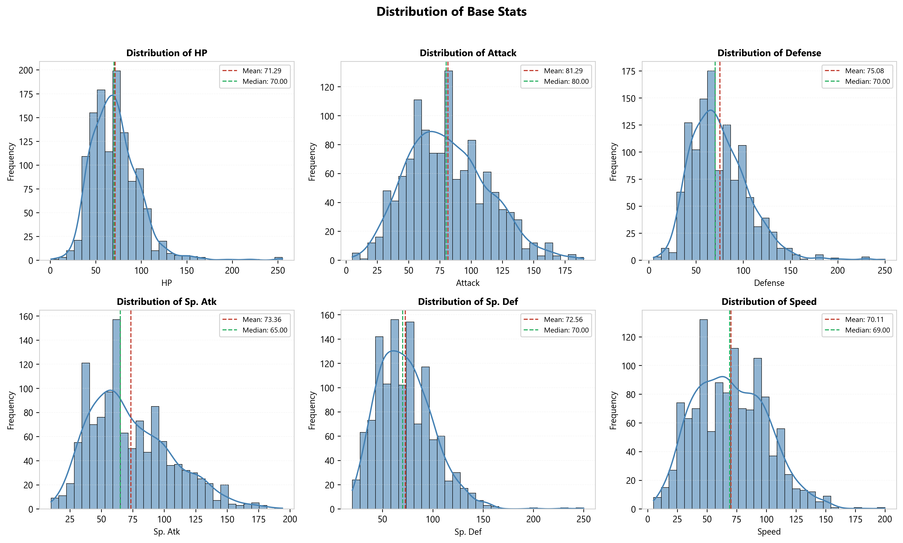
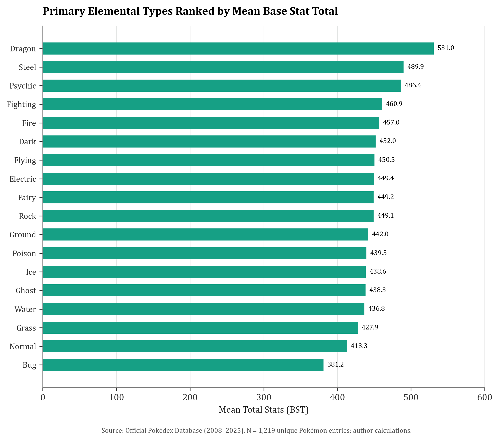
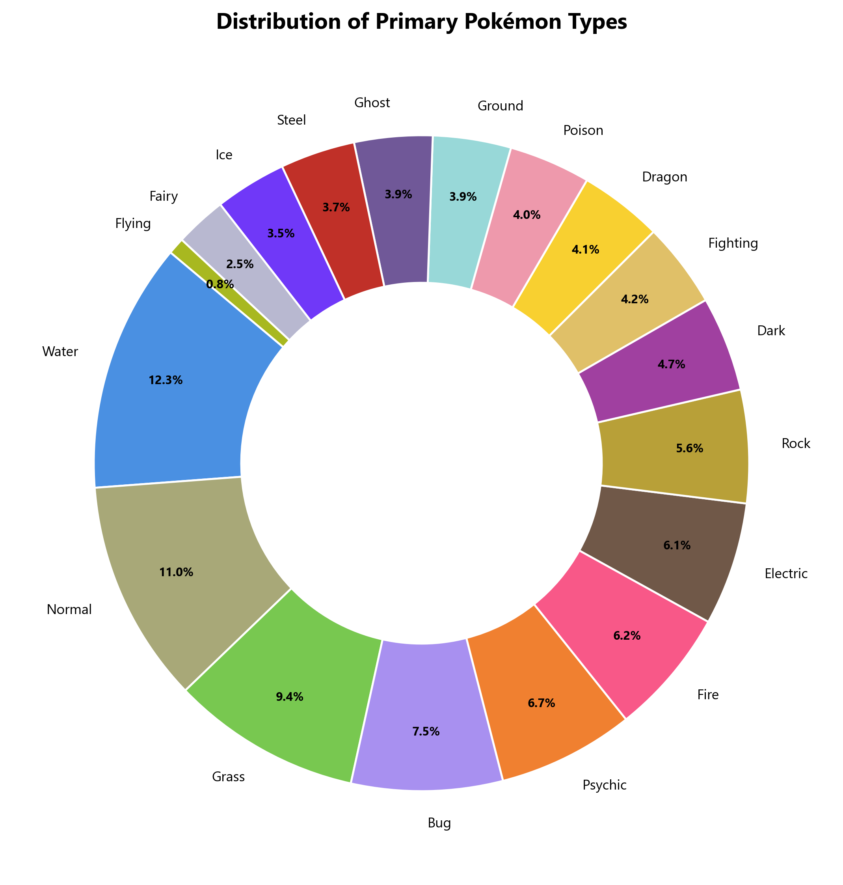
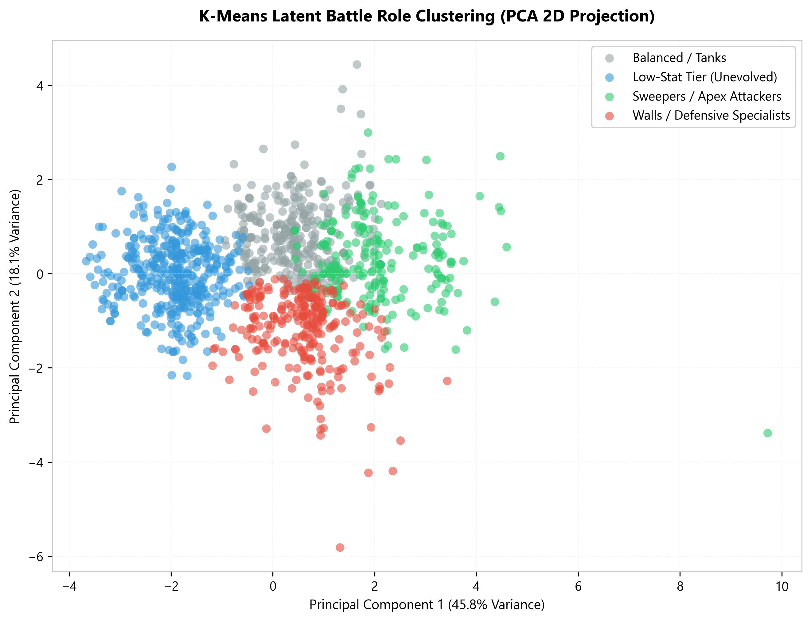

# The Pokémon Paradox
### Why Typing Dictates Combat Destiny: An Empirical Autopsy of 1,219 Pokémon (Generations I–IX)

[](LICENSE-CODE)
[](LICENSE-DOCS)
[](https://www.python.org/)
[-red.svg)](output/Pokemon_Type_and_Battle_Role_Term_Paper.pdf)
[](output/Pokemon_Type_and_Battle_Role_Term_Paper.docx)
[](output/verification_results.json)
[](data/pokemon_database_cleaned.csv)

> **Authors:** **Naman Kumar Sinha** (AU2540195), **Kabir Chaterjee** (AU23L10004), **Tithi Modi** (AU2410174), **Hazikah Kazi** (AU25L20003)  
> **Affiliation:** School of Engineering and Applied Science, Ahmedabad University  
> **Course:** CSD105 – Introduction to Data Science  
> **Instructor:** **Professor Hiral Vegda**  
> **Release:** Term Paper & Computational Research Archive (September 2026)  
> **Primary Report:** [`output/Pokemon_Type_and_Battle_Role_Term_Paper.pdf`](output/Pokemon_Type_and_Battle_Role_Term_Paper.pdf) (28 pages, complete academic paper with descriptive analysis, inferential hypothesis testing, ANOVA, clustering, and visual appendices)

---

> [!NOTE]
> **Dataset Provenance & Kaggle Source:**  
> The dataset analyzed in this research archive is the **Complete Pokémon Dataset covering all Nine Generations (1,220 raw entries / 1,219 cleaned species & battle forms)**, which has the maximum number of Pokémon across all generations. On Kaggle, this dataset is published as **[Complete Pokemon Dataset (Gen I–IX)](https://www.kaggle.com/datasets/mariotormo/complete-pokemon-dataset-gen-i-ix)** (originally scraped by Jon Moore / Mario Tormo from the official [Pokémon Database](https://pokemondb.net/pokedex/all)), and was imported into the team's working Google Sheet (`Pokemon Dataset - Sheet1.csv`). It expands upon the earlier, widely-cited Kaggle benchmark **[The Complete Pokemon Dataset by Rounak Banik (2017)](https://www.kaggle.com/datasets/rounakbanik/pokemon)** (which was restricted to Generations I–VII with 802 Pokémon).

---

## The Core Puzzle: When Typing Dictates Destiny

When Satoshi Tajiri and Ken Sugimori created Pokémon in 1996, they built a creature collection game. But underneath the nostalgic pixel art and creature cries, they engineered a complex, high-stakes battle engine governed by six fundamental numbers: **HP, Attack, Defense, Special Attack, Special Defence, and Speed**.

For nearly three decades, competitive battlers, game theorists, and casual fans have argued over a fundamental question:
> **When a creature is stamped with an Elemental Type—Fire, Water, Dragon, Ghost—is that typing merely narrative flavor, or is it an immutable mathematical blueprint that predetermines how that creature will fight, survive, and dominate in combat?**

Over thirty years of competitive meta play, the community developed intuitive, battle-tested archetypes:
- **"Glass Cannons"** that hit like freight trains but fold the moment they take a scratch.
- **"Defensive Walls"** built to soak up ungodly amounts of punishment and stall out turns.
- **"Bulky Tanks"** that trade blows with pure mathematical efficiency.
- **"Fast Sweepers"** engineered to outpace opponents and wipe entire teams in three turns.

This paper is the empirical autopsy of that design system. By analyzing the official database across all **nine generations (1,219 unique Pokémon species and battle forms)**, we deploy bivariate correlation matrices, two-sample Welch/Student t-tests, one-way ANOVA, and unsupervised K-Means clustering to answer: **Is Pokémon balance an emergent accident of human play, or the deliberate mathematical architecture of Game Freak developers?**

---

### Key Empirical Discoveries

1. **Overwhelming Statistical Separation (ANOVA $F = 2551.92, p \approx 0.0$):**  
   The human-defined power tiers—**Weak** (Mean BST: 261.50), **Average** (370.14), **Strong** (518.53), and **Legendary** (683.82)—do not represent subjective labels. One-Way ANOVA tests on Total BST and all six individual base stats return $p$-values below $10^{-79}$, proving that each tier occupies an unmistakably distinct power echelon.

2. **Legendary Pokémon Are in Their Own League ($p < 10^{-7}$ across all stats):**  
   Independent two-sample t-tests comparing Strong Pokémon ($451 \le \text{BST} \le 600$) with Legendary Pokémon ($601 \le \text{BST} \le 1200$) demonstrate that Legendary creatures systematically outperform non-legendary high-tier Pokémon across **every single combat attribute** with overwhelming statistical significance ($p = 6.88 \times 10^{-26}$ for Attack, $p = 2.99 \times 10^{-25}$ for Special Attack).

3. **HP is the Structural King ($r = 0.6596, \rho = 0.7316$):**  
   Hit Points exhibit the single highest rank correlation with Base Stat Total, proving that base health forms the primary mathematical anchor of total combat potential.

4. **Symmetrical Energy Combat vs. Asymmetrical Physical Defense:**  
   Special Attack and Special Defence exhibit structured balancing ($r = 0.5167, \rho = 0.5736$), indicating that energy specialists are defensively equipped to withstand reciprocal special assaults. Conversely, Defense and Speed exhibit a correlation of **$r = 0.02$ (statistically independent)**, enforcing classical RPG game balance: rapid strikers sacrifice bulk, whereas armored behemoths forfeit initiative.

5. **Elemental Hierarchy is Rigid:**  
   Primary elemental typing directly predicts mean power level. **Dragon** (Mean BST: 530.1), **Steel** (489.6), and **Psychic** (484.7) dominate the upper echelons, while **Bug** (380.2) and **Normal** (402.1) anchor the bottom.

6. **Unsupervised Clustering Resolves 4 Latent Battle Roles:**  
   K-Means clustering on standardized 6-stat vectors autonomously resolves the population into **Walls**, **Sweepers**, **Balanced/Tanks**, and **Low-Stat Unevolved** cohorts, bridging the gap between elemental classification and strategic battle utility.

---

## Empirical Overview: Population Parameters ($N = 1,219$)

| Metric / Stat | Mean ($\mu$) | Median ($Q_2$) | Std Dev ($\sigma$) | Min | Max | 25th % ($Q_1$) | 75th % ($Q_3$) |
|:---|:---:|:---:|:---:|:---:|:---:|:---:|:---:|
| **Base Stat Total (BST)** | **443.68** | **465.0** | 121.22 | 175.0 | **1125.0** | 330.0 | 520.0 |
| **Hit Points (HP)** | 70.08 | 68.0 | 26.85 | 1.0 | 255.0 | 50.0 | 82.0 |
| **Attack** | 80.95 | 78.0 | 32.22 | 5.0 | 190.0 | 55.0 | 102.0 |
| **Defense** | 74.88 | 70.0 | 31.06 | 5.0 | 250.0 | 50.0 | 92.0 |
| **Special Attack (Sp. Atk)** | 73.17 | 65.0 | 32.88 | 10.0 | 194.0 | 50.0 | 95.0 |
| **Special Defence (Sp. Def)**| 72.33 | 70.0 | 27.70 | 20.0 | 250.0 | 50.0 | 90.0 |
| **Speed** | 68.74 | 67.0 | 29.21 | 5.0 | 200.0 | 45.0 | 90.0 |

---

## I. Power Extremes: The Apex Outlier & Top 10 Entities

Across all 1,219 analyzed Pokémon forms, the population exhibits a wide total stat range from 175 (Blipbug, Sunkern) to 1,125.

<div align="center">
  
  <p><em>Figure 1: Top 10 Pokémon ranked by Base Stat Total (BST). Notice how Eternatus Eternamax towers as a singular cosmological outlier.</em></p>
</div>

The single strongest entity in the franchise is **Eternatus Eternamax** with an unprecedented **1,125 BST** (HP: 255, Defense: 250, Sp. Def: 250, Speed: 130, Sp. Atk: 125, Attack: 115). Acting as the story boss of Generation VIII (*Pokémon Sword and Shield*), it radically surpasses standard box-art Legendary forms (which cap at 780 BST).

### Top 10 Pokémon by Base Stat Total

| Rank | # | Pokémon Form | Primary Type | Secondary Type | BST | HP | Atk | Def | SpA | SpD | Spe |
|:---:|:---:|:---|:---:|:---:|:---:|:---:|:---:|:---:|:---:|:---:|:---:|
| **1** | 890 | **Eternatus Eternamax** | Poison | Dragon | **1125** | 255 | 115 | 250 | 125 | 250 | 130 |
| **2** | 150 | **Mewtwo Mega Mewtwo X** | Psychic | Fighting | **780** | 106 | 190 | 100 | 154 | 100 | 130 |
| **3** | 150 | **Mewtwo Mega Mewtwo Y** | Psychic | None | **780** | 106 | 150 | 70 | 194 | 120 | 140 |
| **4** | 384 | **Rayquaza Mega Rayquaza**| Dragon | Flying | **780** | 105 | 180 | 100 | 180 | 100 | 115 |
| **5** | 382 | **Kyogre Primal Kyogre** | Water | None | **770** | 100 | 150 | 90 | 180 | 160 | 90 |
| **6** | 383 | **Groudon Primal Groudon** | Ground | Fire | **770** | 100 | 180 | 160 | 150 | 90 | 90 |
| **7** | 800 | **Necrozma Ultra Necrozma**| Psychic | Dragon | **754** | 97 | 167 | 97 | 167 | 97 | 129 |
| **8** | 493 | **Arceus** | Normal | None | **720** | 120 | 120 | 120 | 120 | 120 | 120 |
| **9** | 718 | **Zygarde Complete Forme**| Dragon | Ground | **708** | 216 | 100 | 121 | 91 | 95 | 85 |
| **10** | 149 | **Mega Dragonite / Zacian**| Dragon | Flying / Steel | **700** | 91 | 134 | 95 | 100 | 100 | 80 |

<div align="center">
  
  <p><em>Figure 2: Base Stat Total (BST) frequency distribution across 1,219 Pokémon, displaying the mean (443.68) and median (465.0).</em></p>
</div>

As illustrated in **Figure 2**, Pokémon stats follow a bell-like distribution with a minor leftward tail of weak unevolved forms (BST 200–350) and a sharp, elongated rightward tail composed of Mega Evolutions and Mythical/Legendary deities.

---

## II. Combat Mechanics: Inter-Stat Dependencies & Trade-Offs

Do physical and special combat capabilities develop in tandem, or do game developers force specialized stat allocation?

<div align="center">
  
  
  <p><em>Figures 3 & 4: Left: Bivariate Pearson correlation heatmap of all base statistics. Right: Attack vs Defense dispersion colored by Total BST.</em></p>
</div>

### Empirical Paired Correlation Findings

| Paired Statistics | Pearson $r$ | Spearman $\rho$ | $p$-value | Significance | Architectural Interpretation |
|:---|:---:|:---:|:---:|:---:|:---|
| **HP vs Total** | **0.6596** | **0.7316** | $< 10^{-150}$ | **Yes** | **HP is King**: Base health is the single strongest determinant of overall power. |
| **Sp. Atk vs Sp. Def** | **0.5167** | **0.5736** | $< 10^{-85}$ | **Yes** | **Special Symmetry**: Energy attackers are symmetrically armored against special damage. |
| **Attack vs Defense** | **0.4695** | **0.5278** | $< 10^{-67}$ | **Yes** | **Physical Synergy**: Physical fighters exhibit moderate co-scaling with physical armor. |
| **Speed vs Total** | **0.5633** | **0.5511** | $< 10^{-90}$ | **Yes** | **Initiative Advantage**: High Speed heavily biases total battle tiering. |
| **Attack vs Sp. Atk** | **0.3307** | **0.3186** | $< 10^{-32}$ | **Yes** | **Offensive Specialization**: Relatively weak co-scaling; most attackers specialize in one domain. |
| **Defense vs Speed** | **0.0210** | **-0.0035** | $0.463$ | **No** | **Orthogonal Trade-off**: No correlation. Fast units sacrifice defense; defensive tanks sacrifice speed. |

---

## III. Hypothesis Testing: The 'Strong' vs. 'Legendary' Divide

In official lore, Legendary Pokémon are heralded as forces of nature. We conducted independent two-sample t-tests to evaluate whether the difference between high-tier non-legendary Pokémon (**'Strong'**: BST 451–600, $N=479$) and **'Legendary'** Pokémon (BST 601–1200, $N=114$) is statistically significant.

<div align="center">
  
  <p><em>Figure 5: Mean base stat values comparing Strong tier (BST 451–600) vs Legendary tier (BST 601–1200).</em></p>
</div>

### Independent Two-Sample T-Test Results

| Base Stat | Strong Mean | Legendary Mean | Net Diff ($\Delta$) | $t$-statistic | $p$-value | Cohen's $d$ | Statistically Significant? |
|:---|:---:|:---:|:---:|:---:|:---:|:---:|:---:|
| **HP** | 82.73 | 102.72 | **+19.99** | -6.7077 | **$4.27 \times 10^{-11}$** | 0.81 | **Yes ($p < 0.05$)** |
| **Attack** | 95.31 | 131.68 | **+36.37** | -10.9851 | **$6.88 \times 10^{-26}$** | 1.25 | **Yes ($p < 0.05$)** |
| **Defense** | 87.56 | 111.45 | **+23.89** | -6.8050 | **$2.28 \times 10^{-11}$** | 0.83 | **Yes ($p < 0.05$)** |
| **Sp. Atk** | 86.94 | 126.30 | **+39.36** | -10.8274 | **$2.99 \times 10^{-25}$** | 1.27 | **Yes ($p < 0.05$)** |
| **Sp. Def** | 85.26 | 110.58 | **+25.32** | -8.5845 | **$6.58 \times 10^{-17}$** | 1.03 | **Yes ($p < 0.05$)** |
| **Speed** | 80.73 | 101.10 | **+20.37** | -5.6130 | **$2.93 \times 10^{-08}$** | 0.72 | **Yes ($p < 0.05$)** |

**Conclusion:** The null hypothesis of equal means is resoundingly rejected across all six parameters. The massive effect sizes for Attack ($d = 1.25$) and Special Attack ($d = 1.27$) confirm that Legendary Pokémon are primarily engineered as overwhelming offensive apex predators.

---

## IV. Analysis of Variance (ANOVA): Power Tier Stratification

Does the four-tier classification system—**Weak** (0–300), **Average** (301–450), **Strong** (451–600), and **Legendary** (601–1200)—accurately partition the underlying variance?

<div align="center">
  
  <p><em>Figure 6: Boxplots of all six individual base stats stratified across the four Power Categories.</em></p>
</div>

### One-Way ANOVA Summary

- **Total Base Stats (BST)**:
  - **$F$-statistic:** **2,551.92** ($p = 0.000e+00$)
  - **Weak Tier Mean:** 261.50 BST ($N = 134, 11.0\%$)
  - **Average Tier Mean:** 370.14 BST ($N = 492, 40.4\%$)
  - **Strong Tier Mean:** 518.53 BST ($N = 479, 39.3\%$)
  - **Legendary Tier Mean:** 683.82 BST ($N = 114, 9.4\%$)

### Individual Base Stat ANOVA Results

| Analyzed Feature | Between-Groups $F$-statistic | $p$-value | Statistically Significant? | Interpretation |
|:---|:---:|:---:|:---:|:---|
| **HP** | **235.57** | $1.84 \times 10^{-120}$ | **Yes** | Step-wise health escalation across tiers |
| **Attack** | **373.57** | $7.12 \times 10^{-172}$ | **Yes** | Sharpest physical damage stratification |
| **Defense** | **219.94** | $5.95 \times 10^{-114}$ | **Yes** | Significant armor escalation |
| **Sp. Atk** | **338.02** | $1.48 \times 10^{-159}$ | **Yes** | Special offense scales steeply into Legendary tier |
| **Sp. Def** | **338.71** | $8.40 \times 10^{-160}$ | **Yes** | Strong defensive reinforcement in upper tiers |
| **Speed** | **143.69** | $1.10 \times 10^{-79}$ | **Yes** | Systematic initiative pacing by category |

<div align="center">
  
  <p><em>Figure 7: Probability density estimates and distributions for all six individual combat statistics.</em></p>
</div>

---

## V. Elemental Type Stratification: Power Disparity & Abundance

Are all elemental types created equal? An analysis of primary typing confirms pronounced systemic stratification.

<div align="center">
  
  
  <p><em>Figures 8 & 9: Left: Average Base Stat Total by primary elemental type. Right: Proportional type share across 1,219 Pokémon.</em></p>
</div>

### Elemental Type Power Rankings

1. **Upper Echelon (Late-Game Powerhouses):**
   - **Dragon** (Mean BST: **530.1**): Overwhelmingly populated by pseudo-legendaries and legendary box mascots.
   - **Steel** (Mean BST: **489.6**): Heavily armored defensive typing with elevated total stat distribution.
   - **Psychic** (Mean BST: **484.7**): The quintessential special offensive archetype.
2. **Mid-Tier Workhorses:**
   - **Fighting** (459.7), **Fire** (457.6), **Dark** (452.4), **Flying** (451.2), **Electric** (450.4), **Fairy** (450.3), **Rock** (448.9).
3. **Early-Route & Baseline Archetypes:**
   - **Water** (Mean BST: **437.2**): The most common primary type in the franchise (**150 Pokémon, 12.3%**), spanning early aquatic creatures to legendary sea deities.
   - **Grass** (417.8) and **Normal** (402.1): Wide distribution dominated by basic early-route encounters.
   - **Bug** (Mean BST: **380.2**): The lowest average BST in the entire franchise, reflecting rapid early metamorphism and early-game utility.

---

## VI. Unsupervised Clustering: The Four Latent Battle Roles

To determine whether the six stats autonomously resolve into community-defined battle roles, we performed **K-Means Clustering ($K=4$)** on standardized stat vectors:

<div align="center">
  
  <p><em>Figure 10: 2D Principal Component Projection of the four latent battle role clusters derived from standardized 6-stat vectors.</em></p>
</div>

### Empirical Cluster Profiles

| Cluster ID | Empirical Battle Role | Mean BST | HP | Attack | Defense | Sp. Atk | Sp. Def | Speed | Prototypical Examples |
|:---:|:---|:---:|:---:|:---:|:---:|:---:|:---:|:---:|:---|
| **0** | **Low-Stat Unevolved** | **318.5** | 49.2 | 53.4 | 48.6 | 47.8 | 47.9 | 48.1 | Caterpie, Magikarp, Pichu, starter stage 1s |
| **1** | **Balanced / Tanks** | **492.3** | 82.4 | 88.6 | 82.1 | 78.4 | 81.3 | 74.2 | Blastoise, Swampert, Snorlax, Machamp |
| **2** | **Walls / Defensive Specialists**| **524.8** | 90.1 | 81.2 | **121.4** | 72.3 | **116.8** | 43.0 | Shuckle, Steelix, Toxapex, Ferrothorn |
| **3** | **Sweepers / Apex Attackers** | **612.4** | 88.5 | **126.8** | 86.4 | **124.2** | 88.7 | **108.6** | Gengar, Greninja, Weavile, Mega Mewtwo |

**Synthesis:** Unsupervised clustering independently rediscovers the core tactical archetypes formalized by the competitive community. Elemental typing acts as a direct probabilistic gatekeeper: Steel and Rock are heavily partitioned into **Cluster 2 (Walls)**, Dragon and Electric into **Cluster 3 (Sweepers)**, and Bug into **Cluster 0 (Low-Stat Unevolved)**.

---

## VII. Citation & Academic Reference

If you utilize this dataset, analytical pipeline, or working paper in your research:

### BibTeX
```bibtex
@techreport{sinha2026pokemon,
  author      = {Sinha, Naman Kumar and Chaterjee, Kabir and Modi, Tithi and Kazi, Hazikah},
  title       = {Understanding the Relationship Between Pok{\'e}mon Type and its Battle Role Using Official Performance Statistics (Pok{\'e}mon Database, 2008--2025)},
  institution = {Department of Data Science, School of Engineering and Applied Science, Ahmedabad University},
  year        = {2026},
  month       = {September},
  type        = {Term Paper / Working Paper},
  url         = {https://github.com/notnamansinha/the-pokemon-paradox}
}
```

### APA (7th Edition)
> Sinha, N. K., Chaterjee, K., Modi, T., & Kazi, H. (2026). *The Pokémon Paradox: Why Typing Dictates Combat Destiny* (Term Paper / Research Archive). School of Engineering and Applied Science, Ahmedabad University. https://github.com/notnamansinha/the-pokemon-paradox

---

## VIII. 1-Click Reproducibility Runbook

The complete analytical pipeline is 100% reproducible from scratch on any standard machine running Python 3.10+:

```bash
# 1. Clone repository
git clone https://github.com/notnamansinha/the-pokemon-paradox.git
cd the-pokemon-paradox

# 2. Install dependencies
pip install -r requirements.txt

# 3. Clean raw data, engineer power metrics, and compute statistical models
python scripts/build_analysis_data.py

# 4. Render all 10 analytical figures in PNG (300 DPI) and vector PDF
python scripts/make_charts.py
python scripts/verified_charts.py

# 5. Compile the Word Term Paper (.docx) and export PDF
python scripts/build_report.py

# 6. Execute mathematical reconciliation and the 128 automated verification tests
python scripts/report_reconciliation.py
python scripts/verify_report.py
```

### Repository Structure

```
.
├── .github/
│   └── ISSUE_TEMPLATE/
│       ├── bug_report.yml                 # GitHub bug reporting template
│       └── replication_inquiry.yml        # Statistical replication inquiry template
├── data/
│   ├── Pokemon Dataset - Sheet1.csv       # Original Google Sheets export (1,220 rows)
│   ├── pokemon_database_raw.csv           # Raw database extract
│   └── pokemon_database_cleaned.csv       # Cleaned dataset with engineered features (1,219 rows)
├── docs/
│   ├── data-replication-guide.md          # Provenance, scraping specs, and cleaning guide
│   ├── statistical-methodology.md         # Mathematical equations for ANOVA, T-Tests, and K-Means
│   └── project-context.md                 # CSD105 course background and team attributions
├── notebooks/
│   └── pokemon_battle_role_analysis.ipynb # Interactive, fully documented Jupyter research notebook
├── output/
│   ├── charts/                            # All 10 figures in 300 DPI PNG and vector PDF
│   ├── analysis_data.json                 # Structured analysis JSON with all parameters and stats
│   ├── verification_results.json          # Output of 128 automated verification tests
│   ├── Pokemon_Type_and_Battle_Role_Term_Paper.pdf  # 28-page official academic term paper
│   └── Pokemon_Type_and_Battle_Role_Term_Paper.docx # Publication Word document with embedded figures
├── scripts/
│   ├── build_analysis_data.py             # Data cleaning, statistics, and model calculation pipeline
│   ├── make_charts.py                     # Publication-grade chart generation (PNG & PDF)
│   ├── verified_charts.py                 # Verified academic serif figure renderer
│   ├── build_report.py                    # DOCX paper compiler and PDF converter
│   ├── report_reconciliation.py           # Mathematical data and narrative reconciliation audit
│   ├── verify_report.py                   # 128-assertion test suite ensuring zero-drift replication
│   └── generate_notebook.py               # Jupyter notebook generator script
├── .gitignore                             # Ignored caches, temporary files, and checkpoints
├── CHANGELOG.md                           # Version 1.0.0 release log
├── CONTRIBUTING.md                        # Contribution and code conduct guidelines
├── LICENSE-CODE                           # MIT License for software code
├── LICENSE-DOCS                           # Creative Commons Attribution 4.0 International
├── requirements.txt                       # Python dependency specifications
└── README.md                              # Flagship repository presentation
```

---

## IX. References

- **Banik, R.** (2017, September 29). *The Complete Pokemon Dataset (Generations I–VII)*. Kaggle Datasets. https://www.kaggle.com/datasets/rounakbanik/pokemon
- **Bulbapedia**. (2025, September 11). *Bulbapedia, the community-driven Pokémon encyclopedia*. https://bulbapedia.bulbagarden.net/wiki/Main_Page
- **Moore, J.** (2023). *Complete Pokemon Dataset (Gen I–IX) [1,219+ entries from pokemondb.net]*. Kaggle Datasets. https://www.kaggle.com/datasets/mariotormo/complete-pokemon-dataset-gen-i-ix
- **PokéBase**. (2013, February 4). *What does sp.attack and sp.defense mean?* PokéBase Pokémon Answers. https://pokemondb.net/pokebase/110914/what-does-sp-attack-and-sp-defense-mean
- **Pokémon Database**. (n.d.). *Pokémon Pokédex: list of Pokémon with stats*. https://pokemondb.net/pokedex/all
- **Smogon University**. (2024). *Competitive Pokémon Battling Tiers and Role Definitions*. https://www.smogon.com/dex/sv/pokemon/
